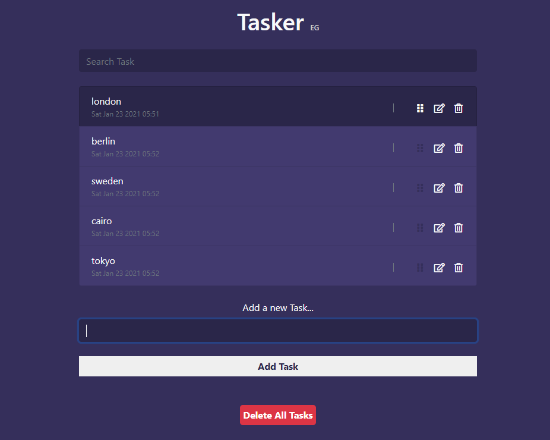

# Tasker

[](https://app.netlify.com/sites/tasker-eg/deploys)

Tasker is a smart tasks list App that allows you to organize and add your daily tasks including other features.

You can view the App from [here](https://tasker-eg.netlify.app/)



## Demo  


## Versions

* [v1](https://github.com/Mohamed-Elhawary/tasker/tree/v1)  

* [v1.1](https://github.com/Mohamed-Elhawary/tasker/tree/v1.1)  

  - Depending on local storage to save the user tasks in case of reloading or close the App.

```
//save data in local storage
function saveDataInStorage() {
  let tasksString  = JSON.stringify(tasks);
  let datesString  = JSON.stringify(tasksDates);
  localStorage.setItem("tasks", tasksString);
  localStorage.setItem("tasks-dates", datesString);
}

//get tasks from local storage
function getDataFromStorage() {
  let tasksString = localStorage.getItem("tasks");
  let datesString = localStorage.getItem("tasks-dates");  
  tasks        = JSON.parse(tasksString);
  tasksDates   = JSON.parse(datesString);
  if(!tasks) { //if there is not any tasks stored in the local storage
    tasks = [];
  }
  if(!tasksDates) { //if there is not any tasksDates stored in the local storage
    tasksDates = [];
  }
}

//initial functions when reloading page
getDataFromStorage();
generateTemplate();
```  

 - Adding date and time for each created task.  

```  
const list      = document.querySelector('.todos');
let tasks       = [];
let tasksDates  = [];

// add tasks
addForm.addEventListener('submit', e => {
  e.preventDefault();
  const date = new Date().toString().slice(0, -45);
  if(taskValue.length){
    tasksDates.push(date);
    saveDataInStorage();
    generateTemplate();
  }
});

//create and inject tasks into the UI
const generateTemplate = () => {
  for (let i in tasks, tasksDates) {
    task  = tasks[i];
    date  = tasksDates[i];
    html += `<div class="date text-muted" style="font-size: 12px">${date}</div>`
  }
  list.innerHTML = html;
}
```  

* [v2.0](https://github.com/Mohamed-Elhawary/tasker/tree/v2.0) 

- Edit any Task and see the last editing date for this edited task.

```
let editedTasks = [];

//create and inject tasks into the UI
const generateTemplate = () => {
  let html = "";
  for (let i in tasks, tasksDates) {
    let task  = tasks[i];
    let date  = tasksDates[i];
    html +=
    `<li class="list-group-item align-items-center" data-index="${i}">
      <div class="d-flex justify-content-between">
        <span class="task-name">${task}</span>
        <input class="edit-task-name" type="text"/>
        <span class="options">
          <i class="far fa-edit edit mr-2"></i>
          <i class="far fa-trash-alt delete"></i>
        </span>
      </div>
      <div class="date text-muted" style="font-size: 12px"><span class="date-text">${date}</span><span class="ml-2 if-edit-task"><span class="edit-text"></span><span class="edit-date bg-light rounded"></span></span></div>
    </li>
    `;
    //console.log(tasks);
    //console.log(tasksDates)
  }
  list.innerHTML = html;

  editedTasks.forEach(task => {
    let editedLI = list.querySelector(`li[data-index = '${task.edited_task_id}']`);
    if(editedLI) {
      editedLI.querySelector("span.edit-text").innerHTML = "edited";
      editedLI.querySelector("span.edit-date").innerHTML = task.edited_task_date;
    }
  });
};

// edit tasks
list.addEventListener('click', e => {
  if(e.target.classList.contains('edit')) {
    let target = e.target;
    let taskName     = target.parentElement.previousElementSibling.previousElementSibling,
        editTaskName = target.parentElement.previousElementSibling;
    if (target.classList.contains("fa-edit")) {
      target.classList.toggle("fa-check-circle");
      target.classList.toggle("fa-edit");
      taskName.style.display = "none";
      editTaskName.style.display = "initial";
      editTaskName.focus();
      editTaskName.value = taskName.innerHTML;
    } else {
      if(editTaskName.value.length > 0) {
        triggerEdit(target, taskName, editTaskName);  
      } else {
        editTaskName.focus();
      }
    }
  }
});

// when clickig enter or esc keys on the edit task name field 
list.addEventListener("keydown", function(event) {
  if(event.target.classList.contains("edit-task-name")) {
    let target   = event.target;
        editSign = target.nextElementSibling.querySelector(".edit"),
        taskName = target.previousElementSibling;
    if(event.keyCode == 13 && event.target.value.length > 0) {
      triggerEdit(editSign, taskName, target)
    } else if(event.keyCode == 27) {
      editSign.classList.toggle("fa-check-circle");
      editSign.classList.toggle("fa-edit");
      taskName.style.display = "initial";
      target.style.display = "none";
    }
  }
});

// trigger edit function
function triggerEdit(target, taskName, editTaskName) {
  target.classList.toggle("fa-check-circle");
  target.classList.toggle("fa-edit");
  taskName.style.display = "initial";
  editTaskName.style.display = "none";
  if(taskName.innerHTML != editTaskName.value) {
    taskName.innerHTML = editTaskName.value;
    tasks[taskName.parentElement.parentElement.getAttribute("data-index")] = taskName.innerHTML;
    editedTasks.forEach((task, i) => {
      if(task.edited_task_id == taskName.parentElement.parentElement.getAttribute("data-index")) {
        editedTasks.splice(i, 1);
      }
    });
    editedTasks.push({
      edited_task_id: taskName.parentElement.parentElement.getAttribute("data-index"),
      edited_task_date: new Date().toString().slice(0, -45),
      edited_task_text: taskName.innerHTML
    });
    generateTemplate();
    saveDataInStorage();  
    //console.log(editedTasks);
  }
}

//save data in local storage
function saveDataInStorage() {
  let editedTasksString = JSON.stringify(editedTasks);
  localStorage.setItem("edited-tasks", editedTasksString);
}

//get tasks from local storage
function getDataFromStorage() {
  let editedTasksString = localStorage.getItem("edited-tasks");  
  editedTasks  = JSON.parse(editedTasksString);
  if(!editedTasks) { //if there is not any editedTasks stored in the local storage
    editedTasks = [];
  }
}
```  

 - Sort the tasks list with your prefer sort by dragging the tasks.  

```  
// trigger the sortable library
new Sortable(sortablelist, {
  animation: 110,
  ghostClass: 'sortable-ghost',
  onUpdate: function() {
    //console.log(tasks);
    //console.log(tasksDates);
    let newTasksArray      = [],
        newTasksDatesArray = [];
    list.querySelectorAll("li .task-name").forEach(task => {
      newTasksArray.push(task.innerHTML)
    });
    //console.log(newTasksArray);
    tasks = newTasksArray;
    //console.log(tasks);
    list.querySelectorAll("li .date-text").forEach(date => {
      newTasksDatesArray.push(date.innerHTML)
    });
    //console.log(newTasksDatesArray);
    tasksDates = newTasksDatesArray;
    //console.log(tasksDates);
    tasks.forEach((task, i) => {
      editedTasks.forEach(editedTask => {
        if(task == editedTask.edited_task_text) {
          editedTask.edited_task_id = i;
        }
      });
    });
    generateTemplate();
    saveDataInStorage();
  }
});
```  

* [v2.1](https://github.com/Mohamed-Elhawary/tasker/tree/v2.1)  

  - Add delete box that popups to the user when clicking on the delete sign to be sure that he wants already to delete the required task.

```
// when clicking on the delete icon
list.addEventListener('click', e => {
  if(e.target.classList.contains('delete')) {
    let deleteBox        = document.createElement("div"),
        deleteField      = document.createElement("p"),
        deleteFieldText  = document.createTextNode("Are you sure to delete this task ?"),
        deleteBtn        = document.createElement("button"),
        cancelBtn        = document.createElement("button"),
        deleteBtnText    = document.createTextNode("Delete"),
        cancelBtnText    = document.createTextNode("Cancel"),
        deletedTask      = e.target.parentElement.parentElement.parentElement;
    
    deleteBtn.appendChild(deleteBtnText);
    cancelBtn.appendChild(cancelBtnText);
    deleteField.appendChild(deleteFieldText);
    deleteBox.appendChild(deleteField);
    deleteBox.appendChild(cancelBtn);
    deleteBox.appendChild(deleteBtn);

    deleteBox.classList.add("delete-box");
    deleteBox.classList.add("filter-from-drag");
    deleteBtn.classList.add("delete-btn");
    cancelBtn.classList.add("cancel-btn");
    deleteField.classList.add("delete-field");
    deletedTask.appendChild(deleteBox);
    deletedTask.querySelector(".task-part").classList.toggle("d-flex");
    deletedTask.querySelector(".task-part").classList.toggle("justify-content-between");
    deletedTask.querySelector(".task-part").classList.toggle("d-none");
    deletedTask.querySelector(".date").classList.toggle("d-none");
  }
});

// delete task 
list.addEventListener("click", e => {
  if(e.target.classList.contains('delete-btn')) {
    let deletedTask = e.target.parentElement.parentElement,
        deleteBox  = e.target.parentElement;
    
    deleteBox.style.display = 'none';
    tasks.splice(deletedTask.getAttribute("data-index"), 1);
    tasksDates.splice(deletedTask.getAttribute("data-index"), 1);
    editedTasks.forEach((editedTask, i) => {
      if(editedTask.edited_task_id == deletedTask.getAttribute("data-index")) {
        editedTasks.splice(i, 1);
      }
    });

    tasks.forEach((task, y) => {
      editedTasks.forEach(editedTask => {
        if(task == editedTask.edited_task_text) {
          editedTask.edited_task_id = y;
        }
      });
    });
    //console.log(tasks);
    //console.log(tasksDates);
    generateTemplate();
    saveDataInStorage();
  }
});

// when clicking on the cancel btn in the tasks list
list.addEventListener("click", e => {
  if(e.target.classList.contains('cancel-btn')) {
    let deleteBox    = e.target.parentElement,
        canceledTask = e.target.parentElement.parentElement;
    deleteBox.parentElement.removeChild(deleteBox);
    canceledTask.querySelector(".task-part").classList.toggle("d-flex");
    canceledTask.querySelector(".task-part").classList.toggle("justify-content-between");
    canceledTask.querySelector(".task-part").classList.toggle("d-none");
    canceledTask.querySelector(".date").classList.toggle("d-none");
  }
});
```

  - Add delete all tasks button that allows to the user to clear the list.

```
const deleteAllTasksBtn = document.querySelector(".danger-zone .delete-all-tasks-btn");
const deleteAllBox      = document.querySelector(".danger-zone .delete-all-box");
const deleteAllBtn      = deleteAllBox.querySelector(".delete-all-btn");
const cancelBtn         = deleteAllBox.querySelector(".cancel-btn");

// when clicking on the delete all tasks btn
deleteAllTasksBtn.addEventListener("click", function() {
  this.classList.toggle("d-none");
  deleteAllBox.classList.toggle("d-none");
});

// delete all tasks (clear the tasks list)
deleteAllBtn.addEventListener("click", function() {
  tasks = [];
  tasksDates = [];
  editedTasks = [];
  generateTemplate();
  saveDataInStorage();
  addForm.reset();
  addForm.add.focus();
  deleteAllTasksBtn.classList.toggle("d-none");
  deleteAllBox.classList.toggle("d-none"); 
});

// when clicking on the cancel btn in the delete all box
cancelBtn.addEventListener("click", function() {
  deleteAllTasksBtn.classList.toggle("d-none");
  deleteAllBox.classList.toggle("d-none");
});
```

* [v2.2](https://github.com/Mohamed-Elhawary/tasker/tree/v2.2)  

  - Add a drag icon that user can uses it to drag tasks and sort his list instead of dragging the task element itself to sort the list. 

```
// create and inject tasks into the UI
const generateTemplate = () => {
    html +=
    `<li class="list-group-item align-items-center task" data-index="${i}">
      <div class="d-flex justify-content-between task-part">
        <span class="task-name">${task}</span>
        <input class="edit-task-name" type="text"/>
        <span class="options">
          <i class="fas fa-grip-vertical drag mr-2 fa-fw"></i>
          <i class="far fa-edit edit mr-2 filter-from-drag fa-fw"></i>
          <i class="far fa-trash-alt delete filter-from-drag fa-fw"></i>
        </span>
      </div>
      <div class="date text-muted" style="font-size: 12px"><span class="date-text">${date}</span><span class="ml-2 if-edit-task"><span class="edit-text filter-from-drag"></span><span class="edit-date bg-light rounded"></span></span></div>
    </li>
    `;
};
```

## Features

* Depneding on local storage to save the tasks from lost.

* Adding the date and time for each created task.


* Search for specific task by enter the task name in the search input field.  


* Delete any task in the list. 


* Edit any Task and see the last editing date for this edited task. 


* Sort the tasks list with your prefer sort by dragging the tasks.


* A popup delete box that appears to the user when clicking on the delete sign to be sure that he wants already to delete the required task.


* Add delete all tasks button that allows to the user to clear the list.


* Add a drag icon that user can uses it to drag tasks and sort his list instead of dragging the task element itself to sort the list. 


## Built With

* HTML5
* CSS3
* Vanilla JS

## Libraries 

* [Sortable.js](https://github.com/SortableJS/Sortable)

## Frameworks

* [Bootstrap 4](https://getbootstrap.com/)

## Author

* [Mohamed Elhawary](https://www.linkedin.com/in/mohamed-elhawary14/)

## Contact me through my social accounts

* Email: mohamed.k.elhawary@gmail.com
* [LinkedIn](https://www.linkedin.com/in/mohamed-elhawary14/)
* [Github](https://github.com/Mohamed-Elhawary)  
* [Behance](https://www.behance.net/mohamed-elhawary14)
* [Codepen](https://codepen.io/Mohamed-ElHawary) 

## License

Licensed under the [MIT License](LICENSE)
